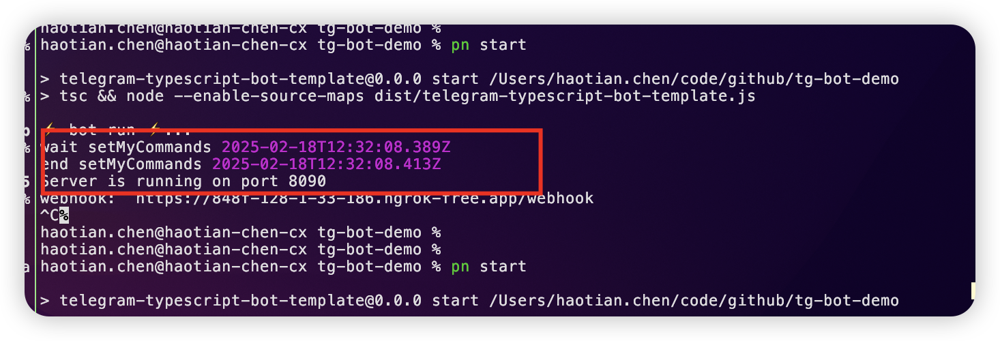

## 根目录启动 ngork

```sh
brew install ngrok
sh script/dev.sh
# 自动启动go server
# 自动启动ngrok
# 自动配置.env中webhook地址
# 下文bot执行时自动设置webhook
```

## 运行 bot

```sh
npm run start
```

## NOTE:

```sh
setMyCommands # 耗时可能久，注意看控制台输出
```



## bot 调用接口


